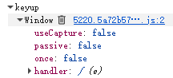

# 📖 简介

由于B站直播的“神人”操作，搞了个 **“G键”被按** ，就会自动关注直播间的功能，**完全没有任何用户确认**，神似 ***“摇一摇”*** 功能

由于本人喜欢用`Win+G`快捷键调节音量，导致经常莫名关注直播间，所以~~一怒之下怒了一下~~写了这个油猴脚本来解决这个**愚蠢**的问题

## ⚛️ 主要功能

如果不是在**可编辑区域**，**统统拦截**`G`键的按键弹起事件

并且可以隐藏和`G 键快捷关注`有关的元素，让页面更干净

还内置了防御性代码，如果失效可以尝试启用激进模式（取消注释代码）

## ⚙️ 安装方法

- 你可以在 [GreasyFork (油叉)](https://greasyfork.org/zh-CN) 上搜索到[本同名项目](https://greasyfork.org/zh-CN/scripts/583797-bilibili%E7%9B%B4%E6%92%AD%E9%97%B4-%E5%BC%BA%E5%88%B6%E7%A6%81%E7%94%A8-g-%E9%94%AE%E5%85%B3%E6%B3%A8)，并直接安装，并且后续能自动更新。这是最便捷的方法
- 你也可以手动下载仓库中的.js文件，并拖动到油猴界面手动安装

## 🛠️ 有关后续维护

> 失效概率：低

后续维护会参考资料和前人的代码进行人工维护

拦截`G`快捷键的功能健壮性很强，失效概率较低，但隐藏CSS元素的功能比较容易失效  
如有发现还欢迎提交issue

### 功能开发计划

- [x] ~~优化重装监听器的性能~~（已经被优化掉了）
- [ ] ~~检测关注状态，以优化性能~~（2.0重构版已对性能无影响）
- [ ] ~~增加禁用严格等级配置~~（2.0重构版已无必要）
- [x] 开发激进模式

有新的功能建议欢迎提issue哦(。・∀・)ノ

## 📃 开发报告

> *本项目最初使用AI生成，现已全部人工重构，[AI使用声明](./docs/README.AI-Disclosure.md)仅作为归档*

经过研究和分析，我发现不止直播间有快捷键关注，视频页也同样有快捷键关注，但为何不像直播间这么烦人呢？主要有以下几点原因：

- **独立按键检测：** 视频页的快捷键有独立按键检测，所以通常不会被其它组合键误触，比较难以感知。而直播间当然没这功能啦
- **人机交互准则：** 其实视频页和直播间的快捷键关注设计，都违反了[尼尔森诺曼集团(NN/g)提出的人机交互准则](https://www.nngroup.com/articles/ten-usability-heuristics/)之一：**系统状态的可见性**[^1]，简而言之就是没有任何明显反馈。  
  但**至少**视频页还能在当前页面“撤销”关注，而直播间没法直接取关，必须再点进个人主页才能“撤销”关注，这就不是一个难易级别的了
- **代码层面的“恶意”：** 直播间使用了`window监听器`，而这是**最顶层的监听器**，所以除非浏览器的功能覆盖了监听器，否则**整个浏览器窗口**都可以被捕获`G`键，并触发自动关注  
  **不仅如此**，监听器还选择了`keyup`(按键弹起)事件，这个事件比较隐蔽，因为**在这个用途下很不常用**，往往会被常规脚本漏掉；而视频页用的就是常规的`keydown`事件了(虽然同样是`window监听器`)
  
  

说了这么多，那么B站到底是故意还是不小心呢？我不好说，留给各位自行判断吧（

[^1]: - 务必向用户清楚地传达系统的状态——在未告知用户的情况下，不应采取任何会对用户造成后果的行动。
    - 尽快（最好是立即）向用户提供反馈。

## 📜 协议&许可证

> 本仓库所有**代码**采用 GPL-3.0 协议进行开源

## 参考和鸣谢

- [Bilibili 20-21年旧版](https://greasyfork.org/zh-CN/scripts/474444-bilibili-20-21%E5%B9%B4%E6%97%A7%E7%89%88)
